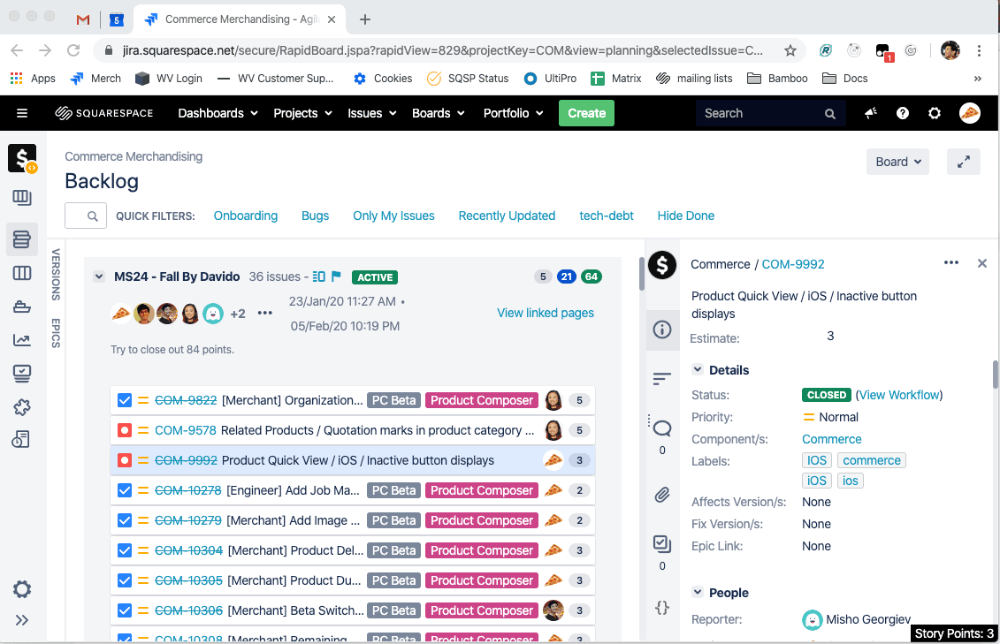

Adds up selected ticket story points in JIRA like Excel/Google sheets. Works in backlog view and active sprint view!

# Installation

1. Install the [Tamper Monkey Chrome Extension](https://chrome.google.com/webstore/detail/tampermonkey/dhdgffkkebhmkfjojejmpbldmpobfkfo?hl=en).
2. Copy the contents of `index.js` and add it as a new script in tamper monkey.
3. Done!
